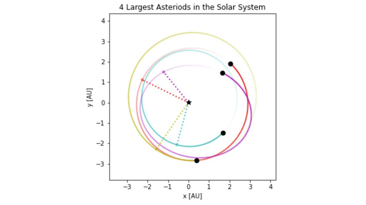

# Planetary System Simulation
Orbit simulation of stars, planets, and asteroids using Astropy, Astroquery, Rebound, and Matplotlib

## Planetary Systems
Systems

## Data Sources

The notebooks query data from the following catalogs:
- [Open Exoplanet Catalogue](http://openexoplanetcatalogue.com/)
- [JPL HORIZONS System](https://ssd.jpl.nasa.gov/?horizons)
- [IAU Minor Planet Center](https://www.minorplanetcenter.net/)

## Run Locally

Install dependencies

```bash
  pip install numpy matplotlib astropy astroquery rebound jupyter 
```

Start Jupyter
```bash
  jupyter notebook
```

## Program Output
Exoplanet System Simulation

Solar System Simulation
